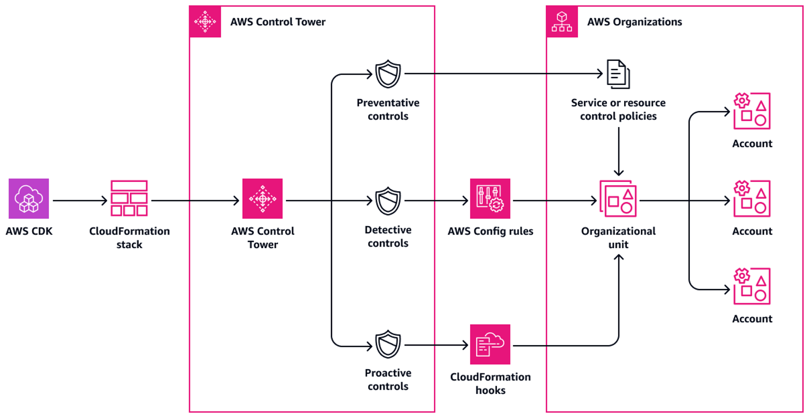

# Deploy and manage AWS Control Tower controls by using AWS CDK and AWS CloudFormation


- [AWS Prescriptive Guidance](#aws-prescriptive-guidance)
- [Goal](#goal)
- [Prerequisites and Limitations](#prerequisites-and-limitations)
- [Architecture](#architecture)
- [Tools](#tools)
- [Best practices](#best-practices)
- [Control Behavior And Guidance](#control-behavior-and-guidance)
- [Setup](#setup)
  - [Requirements](#requirements)
  - [Prepare to enable the controls](#prepare-to-enable-the-controls)
  - [Controls Configuration File](#controls-configuration-file)
- [Deployment](#deployment)
- [Useful Commands](#useful-commands)
- [IAM policy](#iam-policy)
- [Trust policy](#trust-policy)
- [Authors](#authors)
- [Security](#security)
- [License](#license)

## AWS Prescriptive Guidance

For a complete guide, prerequisites and instructions for using this AWS Prescriptive Guidance pattern, see [Deploy and manage AWS Control Tower controls by using AWS CDK and AWS CloudFormation](https://docs.aws.amazon.com/prescriptive-guidance/latest/patterns/deploy-and-manage-aws-control-tower-controls-by-using-aws-cdk-and-aws-cloudformation.html).


## Goal

This pattern describes how to use AWS CloudFormation and AWS Cloud Development Kit (AWS CDK) to implement and administer preventive, detective, and proactive AWS Control Tower controls as infrastructure as code (IaC). A [control](https://docs.aws.amazon.com/controltower/latest/userguide/controls.html) (also known as a guardrail) is a high-level rule that provides ongoing governance for your overall AWS Control Tower environment. For example, you can use controls to require logging for your AWS accounts and then configure automatic notifications if specific security-related events occur.

AWS Control Tower helps you implement preventive, detective, and proactive controls that govern your AWS resources and monitor compliance across multiple AWS accounts. Each control enforces a single rule. In this pattern, you use a provided IaC template to specify which controls you want to deploy in your environment.

AWS Control Tower controls apply to an entire [organizational unit (OU)](https://docs.aws.amazon.com/organizations/latest/userguide/orgs_getting-started_concepts.html#organizationalunit), and the control affects every AWS account within the OU. Therefore, when users perform any action in any account in your landing zone, the action is subject to the controls that govern the OU.

Implementing AWS Control Tower controls helps establish a strong security foundation for your AWS landing zone. By using this pattern to deploy the controls as IaC through CloudFormation and AWS CDK, you can standardize the controls in your landing zone and more efficiently deploy and manage them. This solution uses [cdk_nag](https://github.com/cdklabs/cdk-nag#readme) to scan the AWS CDK application during deployment. This tool checks the application for adherence to AWS best practices.

To deploy AWS Control Tower controls as IaC, you can also use HashiCorp Terraform instead of AWS CDK. For more information, see [Deploy and manage AWS Control Tower controls by using Terraform](https://docs.aws.amazon.com/prescriptive-guidance/latest/patterns/deploy-and-manage-aws-control-tower-controls-by-using-terraform.html).

### Intended Audience

This pattern is recommended for users who have experience with AWS Control Tower, CloudFormation, AWS CDK, and AWS Organizations.

## Prerequisites and Limitations

### Prerequisites

- Active AWS accounts managed as an organization in AWS Organizations and an AWS Control Tower landing zone. For instructions, see [Getting started](https://docs.aws.amazon.com/controltower/latest/userguide/getting-started-with-control-tower.html) in the AWS Control Tower documentation.

- AWS Command Line Interface (AWS CLI), [installed](https://docs.aws.amazon.com/cli/latest/userguide/getting-started-install.html) and [configured](https://docs.aws.amazon.com/cli/latest/userguide/cli-configure-files.html).

- Node package manager (npm), installed and configured for the AWS CDK.

- [Prerequisites](https://docs.aws.amazon.com/cdk/v2/guide/work-with.html#work-with-prerequisites) for AWS CDK.

- Permissions to assume an existing AWS Identity and Access Management (IAM) role in a deployment account.

- Permissions to assume an IAM role in the organization’s management account that that can be used to bootstrap AWS CDK. The role must have permissions to modify and deploy CloudFormation resources. For more information, see [Bootstrapping](https://docs.aws.amazon.com/cdk/v2/guide/bootstrapping.html#bootstrapping-howto) in the AWS CDK documentation.

- Permissions to create IAM roles and policies in the organization’s management account. For more information, see [Permissions required to access IAM resources](https://docs.aws.amazon.com/IAM/latest/UserGuide/access_permissions-required.html) in the IAM documentation.

- Apply the service control policy (SCP)-based control with the identifier CT.CLOUDFORMATION.PR.1. This SCP must be activated to deploy proactive controls. For instructions, see [Disallow management of resource types, modules, and hooks within the AWS CloudFormation registry](https://docs.aws.amazon.com/controltower/latest/userguide/elective-controls.html#disallow-cfn-extensions).

### Limitations

- For AWS Control Tower controls, this pattern requires the use of [global identifiers](https://docs.aws.amazon.com/controltower/latest/controlreference/all-global-identifiers.html) that are in the following format:
`arn:<PARTITION>:controlcatalog:::control/<CONTROL_CATALOG_OPAQUE_ID>`
**Note:** In most cases, the value for `<PARTITION>` is aws.
Previous versions of this pattern used [regional identifiers](https://docs.aws.amazon.com/controltower/latest/controlreference/control-metadata-tables.html) that are no longer supported. We recommend that you migrate from regional identifiers to global identifiers. Global identifiers help you manage controls and expand the number of controls you can use.

- This pattern provides instructions for deploying this solution across AWS accounts, from a deployment account to the organization’s management account. For testing purposes, you can deploy this solution directly in the management account, but instructions for this configuration are not explicitly provided.


## Architecture

This section provides a high-level overview of this solution and the architecture established by the sample code. The following diagram shows controls deployed across the various accounts in the OU.



AWS Control Tower controls are categorized according to their behavior and their guidance. 

There are three primary types of control behaviors:

1.	Preventive controls are designed to prevent actions from occurring. These are implemented with [service control policies (SCPs)](https://docs.aws.amazon.com/organizations/latest/userguide/orgs_manage_policies_scps.html) or [resource control policies (RCPs)](https://docs.aws.amazon.com/organizations/latest/userguide/orgs_manage_policies_rcps.html) in AWS Organizations. The status of a preventive control is either enforced or not enabled. Preventive controls are supported in all AWS Regions.

2. Detective controls are designed to detect specific events when they occur and log the action in CloudTrail. These are implemented with [AWS Config rules](https://docs.aws.amazon.com/config/latest/developerguide/evaluate-config.html). The status of a detective control is either clear, in violation, or not enabled. Detective controls apply only in those AWS Regions supported by AWS Control Tower.

3. Proactive controls scan resources that would be provisioned by AWS CloudFormation and check whether they are compliant with your company policies and objectives. Resources that are not compliant will not be provisioned. These are implemented with [AWS CloudFormation hooks](https://docs.aws.amazon.com/cloudformation-cli/latest/userguide/hooks.html). The status of a proactive control is PASS, FAIL, or SKIP.

Control guidance refers to the recommended practice for how to apply each control to your OUs. AWS Control Tower provides three categories of guidance: mandatory, strongly recommended, and elective. The guidance of a control is independent of its behavior. For more information, see [Control behavior and guidance](https://docs.aws.amazon.com/controltower/latest/userguide/controls.html#control-behavior).


## Tools

### AWS services

- [AWS Cloud Development Kit (AWS CDK)](https://docs.aws.amazon.com/cdk/latest/guide/home.html) is a software development framework that helps you define and provision AWS Cloud infrastructure in code. The [AWS CDK Toolkit](https://docs.aws.amazon.com/cdk/v2/guide/cli.html) is the primary tool for interacting with your AWS CDK app.

- [AWS CloudFormation](https://docs.aws.amazon.com/AWSCloudFormation/latest/UserGuide/Welcome.html) helps you set up AWS resources, provision them quickly and consistently, and manage them throughout their lifecycle across AWS accounts and Regions.

- [AWS Config](https://docs.aws.amazon.com/config/latest/developerguide/WhatIsConfig.html) provides a detailed view of the resources in your AWS account and how they’re configured. It helps you identify how resources are related to one another and how their configurations have changed over time.

- [AWS Control Tower](https://docs.aws.amazon.com/controltower/latest/userguide/what-is-control-tower.html) helps you set up and govern an AWS multi-account environment, following prescriptive best practices.

- [AWS Organizations](https://docs.aws.amazon.com/organizations/latest/userguide/orgs_introduction.html) is an account management service that helps you consolidate multiple AWS accounts into an organization that you create and centrally manage.

### Other tools

- [cdk_nag](https://github.com/cdklabs/cdk-nag#readme) is an open-source tool that uses a combination of rule packs to check AWS Cloud Development Kit (AWS CDK) applications for adherence to best practices.

- [npm](https://docs.npmjs.com/about-npm) is a software registry that runs in a Node.js environment and is used to share or borrow packages and manage deployment of private packages.

- [Python](https://www.python.org/) is a general-purpose computer programming language.


## Best practices

- Adhere to the [principle of least-privilege](https://docs.aws.amazon.com/IAM/latest/UserGuide/best-practices.html#grant-least-privilege) (IAM documentation). The sample IAM policy and trust policy provided in this pattern include the minimum permissions required, and the AWS CDK stacks created in the management account are restricted by these permissions.

- Adhere to the [Best practices for AWS Control Tower administrators](https://docs.aws.amazon.com/controltower/latest/userguide/best-practices.html) (AWS Control Tower documentation).

- Adhere to the [Best practices for developing and deploying cloud infrastructure with the AWS CDK](https://docs.aws.amazon.com/cdk/v2/guide/best-practices.html) (AWS CDK documentation).

- When bootstrapping the AWS CDK, customize the bootstrap template to define policies and the trusted accounts that should have the ability to read and write to any resource in the management account. For more information, see [Customizing bootstrapping](https://docs.aws.amazon.com/cdk/v2/guide/bootstrapping.html#bootstrapping-customizing).

- Use code analysis tools, such as [cfn_nag](https://github.com/stelligent/cfn_nag), to scan the generated CloudFormation templates. The cfn-nag tool looks for patterns in CloudFormation templates that might indicate the infrastructure is not secure. You can also use cdk-nag to check your CloudFormation templates by using the [cloudformation-include](https://docs.aws.amazon.com/cdk/latest/guide/use_cfn_template.html#use_cfn_template_install) module.


## Control Behavior And Guidance

[Controls are categorized according to their behavior and their guidance.](https://docs.aws.amazon.com/controltower/latest/userguide/controls.html)

[For a full list of preventive, detective and proactive available controls, see the The AWS Control Tower controls library.](https://docs.aws.amazon.com/controltower/latest/userguide/controls-reference.html)


## Setup

### Requirements
To deploy this solution, you need


| Name | Version |
|------|---------|
| <a name="requirement_ct"></a> [AWS Control Tower](https://aws.amazon.com/controltower/) | >= 3.2 |
| <a name="requirement_python"></a> [Python](https://www.python.org/) | >= 3.9 |
| <a name="requirement_npm"></a> [npm](https://www.npmjs.com/) | >= 8.9.0 |


The `cdk.json` file tells the CDK Toolkit how to execute the code.
The `package.json` requires `npm` to be already installed.


### Prepare to enable the controls

1. Create an IAM policy in the management account with the permissions defined in IAM policy in the [Additional information](https://docs.aws.amazon.com/prescriptive-guidance/latest/patterns/deploy-and-manage-aws-control-tower-controls-by-using-aws-cdk-and-aws-cloudformation.html#deploy-and-manage-aws-control-tower-controls-by-using-aws-cdk-and-aws-cloudformation-additional) section. For instructions, see [Creating IAM policies](https://docs.aws.amazon.com/IAM/latest/UserGuide/access_policies_create.html) in the IAM documentation. Make note of the Amazon Resource Name (ARN) of the policy. The following is an example ARN.
    ```
    arn:aws:iam::<MANAGEMENT-ACCOUNT-ID>:policy/<POLICY-NAME>
    ```

2. Create an IAM role in the management account, attach the IAM permission policy that you created in the previous step, and attach the custom trust policy in Trust policy in the [Additional information](https://docs.aws.amazon.com/prescriptive-guidance/latest/patterns/deploy-and-manage-aws-control-tower-controls-by-using-aws-cdk-and-aws-cloudformation.html#deploy-and-manage-aws-control-tower-controls-by-using-aws-cdk-and-aws-cloudformation-additional) section. For instructions, see [Creating a role using custom trust policies](https://docs.aws.amazon.com/IAM/latest/UserGuide/id_roles_create_for-custom.html) in the IAM documentation. The following is an example ARN for the new role.
    ```
    arn:aws:iam:: MANAGEMENT-ACCOUNT-ID:role/ROLE-NAME
    ```

3. In the management account, assume a role that has permissions to bootstrap AWS CDK.

4.	Enter the following command, replacing the following:
    - `<MANAGEMENT-ACCOUNT-ID>` is the ID of the organization’s management account.
    - `<AWS-CONTROL-TOWER-REGION>` is the AWS Region where Control Tower is deployed. For a complete list of Region codes, see [Regional endpoints](https://docs.aws.amazon.com/general/latest/gr/rande.html#regional-endpoints) in AWS General Reference.
    - `<DEPLOYMENT-ACCOUNT-ID>` is the ID of the deployment account.
    - `<DEPLOYMENT-ROLE-NAME>` is the name of the IAM role you are using the deployment account.
    - `<POLICY-NAME>` is the name of the policy you created in the management account.
    ```
    $ npx cdk bootstrap aws://MANAGEMENT-ACCOUNT-ID/AWS-CONTROL-TOWER-REGION \
    --trust arn:aws:iam::DEPLOYMENT-ACCOUNT-ID:role/DEPLOYMENT-ROLE-NAME \
    --cloudformation-execution-policies arn:aws:iam::MANAGEMENT-ACCOUNT-ID:policy/POLICY-NAME
    ```

### Controls Configuration File
The following is an example of an updated constants.py file.
```
ACCOUNT_ID = 111122223333
AWS_CONTROL_TOWER_REGION = us-east-2
ROLE_ARN = "arn:aws:iam::111122223333:role/CT-Controls-Role"
GUARDRAILS_CONFIGURATION = [
    {
        "Enable-Control": {
            "503uicglhjkokaajywfpt6ros": {
                "Parameters": {
                    "ExemptedPrincipalArns": ["arn:aws:iam::111122223333:role/RoleName"]
                },
                "Tags": [{"key": "Environment", "value": "Production"}]
            },
            ...
        },
        "OrganizationalUnitIds": ["ou-1111-11111111", "ou-2222-22222222"...],
    },
    {
        "Enable-Control": {
            "50z1ot237wl8u1lv5ufau6qqo",
            ...
        },
        "OrganizationalUnitIds": ["ou-2222-22222222"...],
    },
]
```

1. In the cloned repository, open the constants.py file.

2. In the `ACCOUNT_ID` parameter, enter the ID of your management account.

3. In the `<AWS-CONTROL-TOWER-REGION>` parameter, enter AWS Region where AWS Control Tower is deployed.

4. In the `ROLE_ARN` parameter, enter the ARN of the role you created in the management account.

5. Open [All global identifiers](https://docs.aws.amazon.com/controltower/latest/controlreference/all-global-identifiers.html) in the AWS Control Tower documentation.

6. In the JSON-formatted list, locate the control that you want to implement, and then copy its global identifier (also known as the `{CONTROL_CATALOG_OPAQUE_ID}` value). For example, the global identifier for the `AWS-GR_ENCRYPTED_VOLUMES` control is `503uicglhjkokaajywfpt6ros`.

7. In the `GUARDRAILS_CONFIGURATION` section, in the `Enable-Control` parameter, enter the global identifier that you copied. Enter the identifier in double quotation marks, and separate multiple identifiers with commas.

8. In the `GUARDRAILS_CONFIGURATION` section, in the `OrganizationalUnitIds` parameter, enter the ID of the organizational unit where you want to enable the control, such as `ou-1111-11111111`. Enter the ID in double quotation marks, and separate multiple IDs with commas. For more information about how to retrieve OU IDs, see [Viewing the details of an OU](https://docs.aws.amazon.com/organizations/latest/userguide/orgs_manage_org_details.html#orgs_view_ou).

9. Save and close the constants.py file. For an example of an updated constants.py file, see the [Additional information](https://docs.aws.amazon.com/prescriptive-guidance/latest/patterns/deploy-and-manage-aws-control-tower-controls-by-using-aws-cdk-and-aws-cloudformation.html#deploy-and-manage-aws-control-tower-controls-by-using-aws-cdk-and-aws-cloudformation-additional) section of this pattern.


## Deployment

1. In the deployment account, assume the IAM role that has permissions to deploy the AWS CDK stacks in the management account. For more information about assuming an IAM role in the AWS CLI, see [Use an IAM role in the AWS CLI](https://docs.aws.amazon.com/cli/latest/userguide/cli-configure-role.html).

2. If you are using Linux or MacOS:
    1.	Enter the following command to create a virtual environment.
        ```
        $ python3 -m venv .venv
        ```
    2.	After the virtual environment is created, enter the following command to activate it.
        ```
        $ source .venv/bin/activate
        ```
3. If you are using Windows:
    1.	Enter the following command to activate a virtual environment.
        ```
        % .venv\Scripts\activate.bat
        ```

4. After the virtual environment is activated, enter the following command to run the install_deps.sh script. This script installs the required dependencies.
    ```
    $ ./scripts/install_deps.sh
    ```

5. Enter the following command to synthesize and deploy the CloudFormation stack.
    ```
    $ npx cdk synth
    $ npx cdk deploy
    ```

## Useful Commands

 * `npx cdk ls`          list all stacks in the app
 * `npx cdk synth`       emits the synthesized CloudFormation template
 * `npx cdk deploy`      deploy this stack
 * `npx cdk destroy`     destroy this stack
 * `npx cdk diff`        compare deployed stack with current state
 * `npx cdk docs`        open CDK documentation


## IAM policy

The following sample policy allows the minimum actions required to enable or disable AWS Control Tower controls when deploying AWS CDK stacks from a deployment account to the management account.
```
{
    "Version": "2012-10-17",
    "Statement": [
        {
            "Effect": "Allow",
            "Action": [
                "controltower:EnableControl",
                "controltower:DisableControl",
                "controltower:GetControlOperation",
                "controltower:GetEnabledControl",
                "controltower:ListControlOperations",
                "controltower:ListEnabledControls",
                "controltower:ListTagsForResource",
                "controltower:ResetEnabledControl",
                "controltower:TagResource",
                "controltower:UntagResource",
                "controltower:UpdateEnabledControl",
                "organizations:AttachPolicy",
                "organizations:CreatePolicy",
                "organizations:DeleteResourcePolicy",
                "organizations:DeletePolicy",
                "organizations:DescribeOrganization",
                "organizations:DescribeOrganizationalUnit",
                "organizations:DescribePolicy",
                "organizations:DescribeResourcePolicy",
                "organizations:DetachPolicy",
                "organizations:DisablePolicyType",
                "organizations:EnablePolicyType",
                "organizations:ListAccounts",
                "organizations:ListAWSServiceAccessForOrganization",
                "organizations:ListChildren",
                "organizations:ListOrganizationalUnitsForParent",
                "organizations:ListParents",
                "organizations:ListPolicies",
                "organizations:ListPoliciesForTarget",
                "organizations:ListRoots",
                "organizations:ListTagsForResource",
                "organizations:ListTargetsForPolicy",
                "organizations:TagResource",
                "organizations:PutResourcePolicy",
                "organizations:UntagResource",
                "organizations:UpdatePolicy",
                "ssm:GetParameters"
            ],
            "Resource": "*"
        }
    ]
}
```

## Trust policy

The following custom trust policy allows a specific IAM role in the deployment account to assume the IAM role in the management account. Replace the following:
- `<DEPLOYMENT-ACCOUNT-ID>` is the ID of the deployment account
- `<DEPLOYMENT-ROLE-NAME>` is the name of the role in the deployment account that is allowed to assume the role in the management account 

```
{
    “Version”: “2012-10-17”,
    “Statement”: [
        {
            “Effect”: “Allow”,
            “Principal”: {
                “AWS”: “arn:aws:iam::<DEPLOYMENT-ACCOUNT-ID>:role/<DEPLOYMENT-ROLE-NAME>”
            },
            “Action”: “sts:AssumeRole”,
            “Condition”: {}
        }
    ]
}
```

## Authors

Pattern created by Ivan Girardi (AWS) and Iker Reina Fuente (AWS).

## Security

See [CONTRIBUTING](CONTRIBUTING.md#security-issue-notifications) for more information.

## License

This library is licensed under the MIT-0 License. See the [LICENSE](LICENSE) file.
